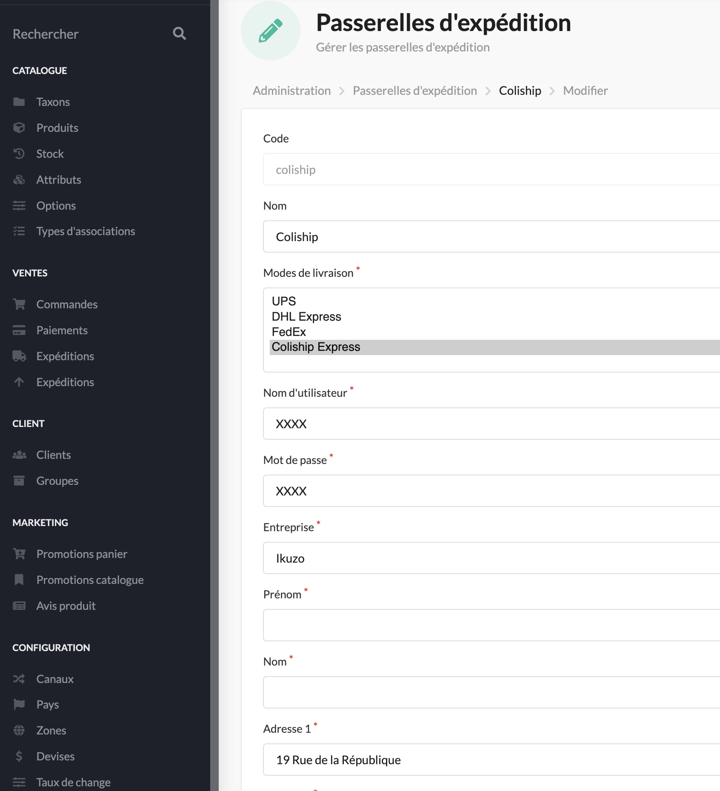

<p align="center">
    <a href="https://sylius.com" target="_blank">
        
    </a>
</p>

<h1 align="center">Coliship Colissimo Export Plugin</h1>

<p align="center">Export Colissimo thought laposte web service with Sylius .</p>
<p align="center">/!\ Currently in alpha /!\</p>

## Quickstart

Install & configure [BitBagCommerce / SyliusShippingExportPlugin](https://github.com/BitBagCommerce/SyliusShippingExportPlugin).


```
$ composer require ikuzostudio/coliship-plugin
```

Add plugin dependencies to your `config/bundles.php` file:

```php
return [
  // ...
  Ikuzo\SyliusColishipPlugin\IkuzoSyliusColishipPlugin::class => ['all' => true],
];
```

Import required config in your `config/packages/_sylius.yaml` file:

```yaml
# config/packages/_sylius.yaml

imports:
  ...
  - { resource: "@IkuzoSyliusColishipPlugin/Resources/config/grid.yml"}
```

Import routing in your `config/routes.yaml` file:

```yaml
ikuzo_coliship_export_plugin:
  resource: "@IkuzoSyliusColishipPlugin/Resources/config/routing.yml"
  prefix: /admin
```

Extend bitbag shipping entity
```php
<?php

declare(strict_types=1);

namespace App\Entity\Shipping;

// [...]
use Sylius\Component\Core\Model\Shipment as BaseShipment;
use Ikuzo\SyliusColishipPlugin\Model\ShippingExportTrait;

/**
 * @ORM\Entity
 * @ORM\Table(name="sylius_shipment")
 */
class Shipment extends BaseShipment
{
    use ShippingExportTrait;
}
```

Update your database

```
$ bin/console doctrine:schema:update --force
```

If you want API Endpoint to generate labels, add this to your route.yml

```yaml
ikuzo_api_coliship_export:
    resource: "@IkuzoSyliusColishipPlugin/Resources/config/routing_api.yml"
```

Then configure your new Coliship gateway 



